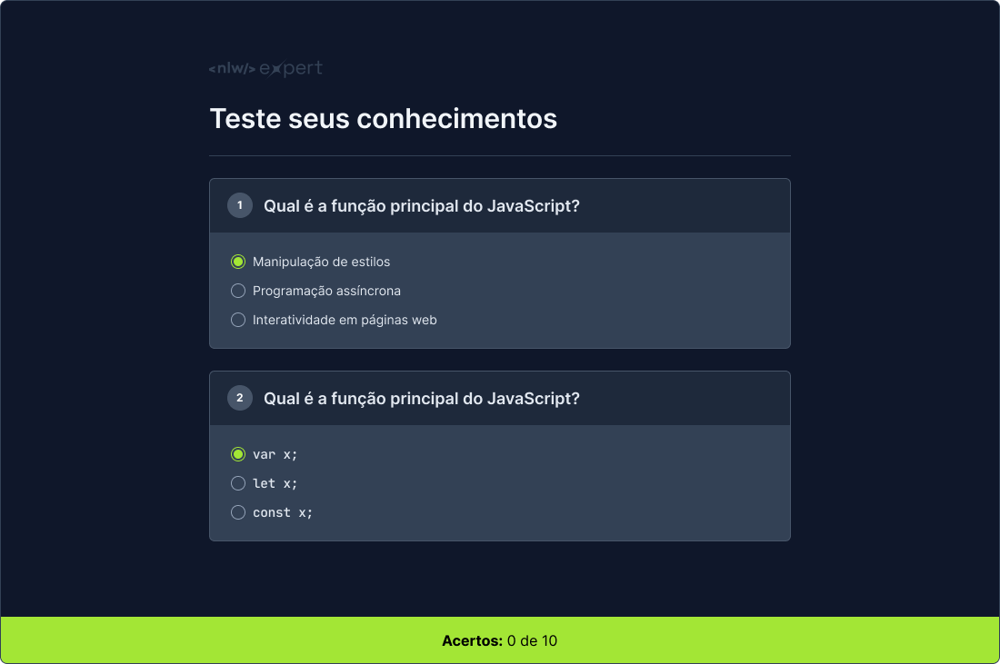

  

Aplicação desenvolvida durante o evento NLW Expert da Rocketseat, na trilha HTML+CSS+JS.

  <a href="#-tecnologias">Tecnologias</a>&nbsp;&nbsp;&nbsp;|&nbsp;&nbsp;&nbsp;
  <a href="#-projeto">Projeto</a>&nbsp;&nbsp;&nbsp;|&nbsp;&nbsp;&nbsp;
  <a href="#-layout">Layout</a>&nbsp;&nbsp;&nbsp;|&nbsp;&nbsp;&nbsp;
  <a href="#memo-licença">Licença</a>

  

 

  

## 🚀 Tecnologias

Esse projeto foi desenvolvido com as seguintes tecnologias:

- HTML
- CSS
- JavaScript
- IA (para geração das perguntas)

## 💻 Projeto

- O projeto consiste em um quiz interativo para testar conhecimentos técnicos em JavaScript.  
Composta por 10 questões de múltipla escolha, a aplicação trará um retorno sobre a quantidade de respostas corretas.
  
- [Acesse o projeto finalizado, online](https://bernardosa01.github.io/NLW-Expert)

## 🔖 Layout

Você pode visualizar o layout do projeto através [DESSE LINK](https://www.figma.com/community/file/1336455726859616027/nlw-expert-quiz). É necessário ter conta no [Figma](https://figma.com) para acessá-lo.

## 📝 Licença

Esse projeto está sob a licença MIT.  

---
 

 Feito por Bernardo Sá :wave: [Participe da comunidade da Rocketseat!](https://discord.gg/rocketseat)
